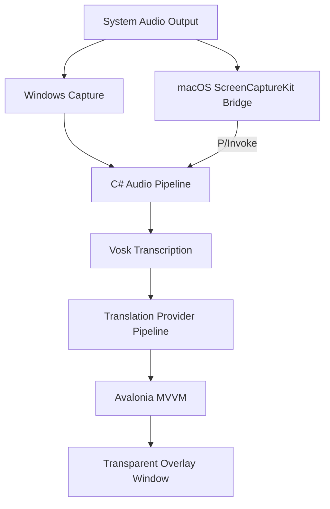

# Sublingual

Sublingual is a cross-platform desktop application for real-time transcription and translation with a transparent subtitle overlay for meetings and system audio.

The app is designed for cases such as:

- online meetings in Google Meet, Microsoft Teams, and Zoom
- videos and media playback from the local machine
- live bilingual subtitles during work, study, or entertainment

## Current Status

This repository is already beyond the planning stage. It currently contains:

- a working Avalonia desktop app shell
- transparent always-on-top overlay rendering
- audio device capture flows
- local Vosk-based speech-to-text integration
- session storage for captured audio and transcripts
- settings persistence under the user profile
- an in-progress realtime translation pipeline with configurable providers
- packaging scripts for macOS and Windows

The project is still under active iteration, especially around translation behavior, packaging polish, and cross-platform capture details.

## Tech Stack

- UI: `Avalonia UI` + `SukiUI`
- Language: `C#`
- Runtime: `.NET 10`
- Architecture style: `MVVM`
- Speech-to-text: `Vosk`
- Translation providers: `GoogleTranslateFreeApi`, `LibreTranslate`
- Windows audio capture: `WASAPI`-based flow
- macOS audio capture: native `ScreenCaptureKit` bridge via `P/Invoke`

## Quick Start

### Prerequisites

- `.NET SDK 10`
- Windows or macOS
- for macOS native capture work: `clang++` and local `ScreenCaptureKit` support

### Run The App

From the repository root:

```bash
dotnet run --project "src/Sublingual.App/Sublingual.App.csproj"
```

There is also a helper script for bash environments:

```bash
bash ./scripts/run-dev.sh
```

### Build The App

```bash
dotnet build "Sublingual.slnx"
```

If you only want the main desktop app:

```bash
dotnet build "src/Sublingual.App/Sublingual.App.csproj"
```

## First Run Notes

- the main desktop entry point is `src/Sublingual.App`
- the app minimizes to the system tray instead of exiting immediately
- speech-to-text models are stored under the app data folder and can be installed from inside the app
- session audio, transcript data, and settings are persisted under the user profile

## App Data And Configuration

By default, Sublingual stores local data under:

```text
~/.sublingual
```

This includes:

- `settings.json`
- `sessions/`
- `speech-to-text-models/`

Default behavior visible in the current codebase:

- source language defaults to `en`
- target language defaults to `vi`
- translation provider order defaults to `GoogleTranslateFreeApi` then `LibreTranslate`
- session data is saved as captured audio plus transcript metadata in the session folder tree

## Platform Support

### Windows

- desktop app: available
- overlay window: available
- packaged publish output: available
- audio capture pipeline: available in repo

### macOS

- desktop app: available
- overlay window: available
- native `ScreenCaptureKit` bridge: available in repo
- packaged publish output and `.app` bundle scripts: available

### Not Finished Yet

- code signing and notarization are not part of the default release flow
- Windows installer or `.msi` is not included yet
- translation quality and realtime behavior are still being refined

## Architecture Overview



Runtime flow:

1. launch the desktop app
2. choose an audio device or capture source
3. start capture
4. normalize and chunk incoming audio
5. run local speech-to-text
6. optionally translate recognized text
7. render subtitles in the transparent overlay
8. persist session artifacts for later review

## Repository Structure

- `src/Sublingual.App` - main Avalonia desktop application
- `src/Sublingual.Domain` - domain contracts and transcription models
- `src/Sublingual.Application` - application-level abstractions and workflow scaffolding
- `src/Sublingual.Infrastructure` - infrastructure layer
- `src/Sublingual.Interop` - interop support for native integrations
- `src/Sublingual.UI` - shared UI project surface
- `native/macos/ScreenCaptureKitBridge` - native macOS capture bridge
- `scripts/` - run and packaging scripts
- `docs/` - architecture notes, packaging docs, and technical decisions

## Packaging

Packaging scripts are already included.

Windows:

```powershell
pwsh ./scripts/package-windows.ps1
```

macOS zip publish:

```bash
bash ./scripts/package-macos.sh
```

macOS `.app` bundle:

```bash
bash ./scripts/package-macos-app.sh
```

See `docs/PACKAGING.md` for full packaging details, runtime identifiers, signing notes, and output layout.

## Documentation

- High-level architecture: `docs/OVERVIEW.md`
- Packaging guide: `docs/PACKAGING.md`
- Realtime translation planning: `docs/REALTIME-TRANSLATION-PLAN.md`
- macOS JIT crash notes: `docs/KNOWN-ISSUES-MACOS-JIT-CRASH.md`
- Architecture notes:
  - `docs/architecture/audio-pipeline.md`
  - `docs/architecture/windows-wasapi.md`
  - `docs/architecture/macos-screencapturekit.md`
- Technical decisions:
  - `docs/decisions/001-native-desktop-stack.md`
  - `docs/decisions/002-audio-capture-abstraction.md`
- Task breakdown and planning: `tasks/prd-lingostream-mvp/`

## Known Gaps

- README does not yet include screenshots or a usage walkthrough
- translation provider behavior may still change as the pipeline is refined
- final release/distribution flow still needs signing and installer polish

## Suggested GitHub Description

`Cross-platform desktop app for real-time transcription and translation with a transparent overlay for meetings and system audio.`
