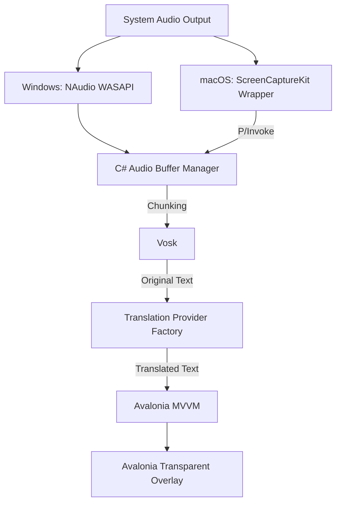

# Sublingual

Sublingual is a cross-platform desktop application for real-time captions and translation. It is designed to capture live meeting audio and system audio, transcribe speech, translate the text, and render the result as a floating transparent overlay on screen.

## Overview

The product targets use cases such as:

- online meetings: Google Meet, Microsoft Teams, Zoom
- system audio: YouTube, local videos, media playback
- live bilingual subtitle overlay during work, study, or entertainment

The intended user experience is:

1. launch the desktop app
2. capture audio from the current system output
3. transcribe speech in near real time
4. translate recognized text
5. display subtitles in a transparent always-on-top overlay

## Technical Direction

This project is planned as a native desktop application with a strong focus on:

- low latency
- low memory footprint
- deep OS integration
- transparent always-on-top overlay rendering

### Planned Stack

- UI framework: `Avalonia UI`
- Language: `C#` and `XAML`
- Runtime: `.NET 8+`
- Architecture pattern: `MVVM`

### Audio Capture Strategy

- Windows:
  - `NAudio`
  - `WASAPI` loopback capture
- macOS:
  - native shared library (`.dylib`) in `C++` / `Objective-C++`
  - `ScreenCaptureKit`
  - bridge to .NET via `P/Invoke`

### AI Processing Strategy

- Speech-to-Text:
  - `Vosk` local speech recognition
- Translation:
  - settings-driven translation factory
  - `GoogleTranslateFreeApi`
  - `LibreTranslate`

## Architecture

## Data Flow

1. the app launches a transparent overlay window
2. an OS-specific capture module reads system output audio
3. audio is normalized to `16kHz mono`
4. audio is chunked with fixed windows or VAD
5. chunks are sent to the STT service
6. recognized text is sent to the translation service
7. translated text is pushed to the view model
8. the overlay re-renders subtitles on screen

## Key Challenges

### 1. macOS system audio capture

macOS does not expose system output capture as simply as Windows. The planned direction is to use `ScreenCaptureKit` through a native wrapper instead of relying on virtual audio drivers by default.

### 2. Transparent always-on-top overlay

The overlay must remain readable, topmost, and non-intrusive across both Windows and macOS while preserving click-through behavior where needed.

### 3. Real-time chunking and latency

Short chunks reduce delay but can hurt recognition quality. Longer chunks improve context but increase lag. The expected approach is to use fixed chunk windows plus optional VAD-based splitting.

## Development Milestones

### Phase 1

- setup Avalonia project
- create transparent overlay UI
- bind mock subtitle data

### Phase 2

- implement Windows loopback capture with `NAudio`
- validate saved audio output

### Phase 3

- implement macOS native capture wrapper with `ScreenCaptureKit`
- connect it to .NET via `P/Invoke`

### Phase 4

- keep STT on `Vosk`
- integrate real translation providers through the factory
- connect audio buffer to the network pipeline

### Phase 5

- finalize subtitle styling and overlay controls
- package production builds for Windows and macOS

## Development Setup

### Prerequisites

- `.NET 8 SDK`
- `JetBrains Rider` or `VS Code` with C# tooling
- for macOS native audio work: `LLVM/Clang`

## Documentation

- High-level architecture: `docs/OVERVIEW.md`
- Task breakdown and implementation planning: `tasks/prd-lingostream-mvp/`

## Status

The repository already contains a working Avalonia desktop shell, native capture services, local Vosk transcription, session persistence, and an in-progress translation provider pipeline. The project is under active iteration.
