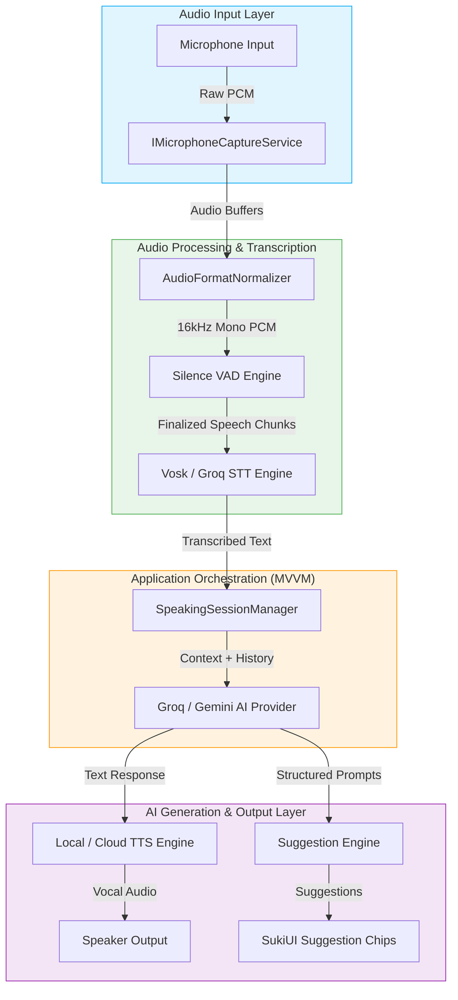

# AI Speaking Practice - Architecture & System Overview

This document describes the high-level architecture, design decisions, and system-wide data flow for the real-time AI Speaking Practice feature in Sublingual.

---

## 1. Feature Goals & Core Capabilities

The AI Speaking Practice feature aims to provide a natural, low-latency conversational environment where users can improve their spoken language proficiency.

*   **Topic-Driven Practice**: Users choose or define a scenario/topic (e.g. *"At the Airport"*, *"Casual Cafe Chat"*, *"Coding Interview"*). The AI tutor naturally guides the conversation, matching the context and adjusting vocabulary difficulty.
*   **Real-time Conversation Loop**: Speech-to-Text (STT) decodes the user's spoken thoughts, pipes it to the AI orchestrator, and plays back the AI's response using Text-to-Speech (TTS).
*   **Intelligent Conversation Prompts (Hints)**: A context-aware suggestion generator provides 2-3 natural options for what the user could say next. This serves as a vital safety net for learners who run out of ideas or get stuck grammatically.
*   **Immersive Audio UI**: Integrated real-time microphone level meter/visualizer, easy playback control, and premium glassmorphic UI elements built on top of SukiUI.

---

## 2. High-Level Architecture Diagram

---

## 3. Component Breakdown

| Module | Core Responsibility | Placement in Codebase |
| :--- | :--- | :--- |
| **Microphone Capture** | Native device enumeration and real-time audio sample streaming. | `Sublingual.Infrastructure/Audio/` |
| **Audio Normalization & VAD** | Conforming raw audio to 16kHz Mono 16-bit PCM and detecting speech pauses. | `Sublingual.Infrastructure/Audio/Processing/` |
| **Speech-to-Text (STT)** | Local or cloud transcribing of voice inputs. | `Sublingual.App/Services/` |
| **AI Orchestration** | Session management, prompt templates, and conversation history. | `Sublingual.Application/SpeakingPractice/` |
| **Text-to-Speech (TTS)** | Vocal synthesis for AI conversational text. | `Sublingual.Infrastructure/TTS/` |
| **SukiUI UX Layer** | High-fidelity interactive screen, level meters, and suggestion controls. | `Sublingual.UI/Views/SpeakingPractice/` |

---

## 4. Cross-Platform Strategy & Dependencies

1.  **Audio Library**: We leverage standard `NAudio` on Windows for Wasapi Loopback & Mic Capture. On macOS, we extend the project's native C++/Objective-C++ `ScreenCaptureKitBridge` `dylib` to load AVFoundation recording components, keeping the framework lean and native.
2.  **Voice Activity Detection**: We implement a lightweight energy-based threshold system in C# that automatically detects when speech has ceased for more than 1.2 seconds, ensuring the conversation flows hands-free without requiring the user to tap "Stop" constantly.
3.  **UI Engine**: Powered by **Avalonia UI** and styled seamlessly with **SukiUI**. Glassmorphic cards, transition animations, and loading hosts will ensure the interface feels exceptionally premium.
