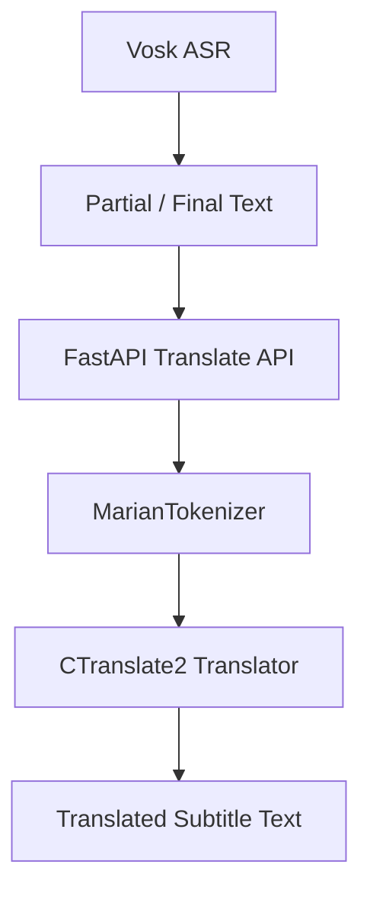

# Translate Service

Standalone self-hosted translation microservice for a Vosk-based live subtitle pipeline.

This service handles translation only.

- No ASR
- No Vosk implementation
- No microphone or audio capture
- No Faster-Whisper

Your existing pipeline stays like this:

```text
Audio
-> Vosk ASR
-> text segment
-> call translate API
-> translated subtitle
```

This service provides the translation stage:

```text
FastAPI translate service
-> Marian tokenizer
-> CTranslate2 Translator
-> translated text
```

## Why Marian + CTranslate2 Instead of LibreTranslate

This service uses MarianMT models converted to CTranslate2 because the main goal is low-latency local inference for realtime subtitles.

Compared to a general-purpose LibreTranslate deployment, this approach gives you:

- lower latency for short subtitle segments
- simpler self-hosted deployment for fixed language pairs such as `en-vi` and `vi-en`
- direct control over model conversion and quantization
- CPU-friendly inference with `int8` CTranslate2 runtime
- no dependency on public translation APIs

The service uses:

- `transformers` only for `MarianTokenizer`
- `ctranslate2` for inference runtime
- `FastAPI` for REST endpoints

## Features

- `GET /health`
- `GET /models`
- `POST /translate`
- `POST /translate/batch`
- `POST /translate/realtime`
- lazy model loading
- in-memory translator cache per language pair
- batch translation
- partial/final subtitle optimization for Vosk realtime text
- Docker support

## Project Structure

```text
translate-service/
  app/
    __init__.py
    main.py
    config.py
    schemas.py
    translator/
      __init__.py
      marian_ct2.py
      model_manager.py
    utils/
      __init__.py
      logger.py
      text.py
  scripts/
    convert_marian_to_ct2.py
    test_translate.py
    benchmark.py
  models/
    .gitkeep
  docker/
    Dockerfile
    docker-compose.yml
  requirements.txt
  README.md
  .env.example
```

## Architecture



## Endpoints

### `GET /health`

Example response:

```json
{
  "status": "ok",
  "device": "cpu",
  "compute_type": "int8",
  "loaded_models": ["en-vi", "vi-en"]
}
```

### `GET /models`

Example response:

```json
{
  "available_pairs": ["en-vi", "vi-en"],
  "base_model_dir": "models/ct2",
  "device": "cpu",
  "compute_type": "int8"
}
```

### `POST /translate`

Example request:

```json
{
  "text": "Hello everyone, welcome to today's meeting.",
  "source_lang": "en",
  "target_lang": "vi"
}
```

### `POST /translate/batch`

Example request:

```json
{
  "texts": [
    "Hello everyone.",
    "Welcome to today's meeting."
  ],
  "source_lang": "en",
  "target_lang": "vi"
}
```

### `POST /translate/realtime`

Example request:

```json
{
  "text": "hello everyone welcome to",
  "source_lang": "en",
  "target_lang": "vi",
  "is_final": false,
  "session_id": "abc123"
}
```

Example skip response:

```json
{
  "translated_text": "",
  "should_display": false,
  "is_final": false,
  "latency_ms": 0
}
```

## Realtime Endpoint Behavior

The realtime endpoint is designed for Vosk partial and final segments.

For `is_final=false`:

- skips text shorter than `MIN_REALTIME_CHARS`
- skips repeated partial text in the same session
- skips partials that only add a very small delta
- skips weak boundaries when the text likely ends mid-word
- may return `should_display=false`

For `is_final=true`:

- always translates if the normalized text is not empty
- updates the session cache with the final result

This behavior is intentionally conservative. For subtitle UX, it is usually better to avoid flickering and redundant translations than to translate every partial token.

## Local Installation

### 1. Create a virtual environment

```bash
python3 -m venv .venv
source .venv/bin/activate
```

### 2. Install dependencies

```bash
pip install -r requirements.txt
```

### 3. Create `.env`

```bash
cp .env.example .env
```

Example `.env`:

```env
MODEL_BASE_DIR=models/ct2
TRANSLATION_DEVICE=cpu
TRANSLATION_COMPUTE_TYPE=int8
INTER_THREADS=1
INTRA_THREADS=4
DEFAULT_SOURCE_LANG=en
DEFAULT_TARGET_LANG=vi
MIN_REALTIME_CHARS=8
MAX_TEXT_CHARS=1000
SESSION_CACHE_TTL_SEC=300
LOG_LEVEL=INFO
```

## Convert Marian Models to CTranslate2

The converter script downloads a Hugging Face Marian model, runs `ct2-transformers-converter`, and saves the tokenizer into the same output directory.

Install local conversion dependencies first:

```bash
./scripts/install_conversion_deps.sh
```

Use another Python interpreter explicitly:

```bash
PYTHON_BIN=./venv/bin/python ./scripts/install_conversion_deps.sh
```

Convert `en-vi`:

```bash
python scripts/convert_marian_to_ct2.py \
  --hf_model Helsinki-NLP/opus-mt-en-vi \
  --output_dir models/ct2/en-vi \
  --quantization int8
```

Convert `vi-en`:

```bash
python scripts/convert_marian_to_ct2.py \
  --hf_model Helsinki-NLP/opus-mt-vi-en \
  --output_dir models/ct2/vi-en \
  --quantization int8
```

Convert `zh-vi`:

```bash
python scripts/convert_marian_to_ct2.py \
  --hf_model Helsinki-NLP/opus-mt-zh-vi \
  --output_dir models/ct2/zh-vi \
  --quantization int8
```

Build all pairs at once on macOS/Linux:

```bash
bash scripts/build_ct2_models.sh
```

Overwrite existing output directories:

```bash
./scripts/build_ct2_models.sh int8 --force
```

Use another quantization type:

```bash
bash scripts/build_ct2_models.sh float16
```

Build all pairs at once on PowerShell:

```powershell
powershell -ExecutionPolicy Bypass -File .\scripts\build_ct2_models.ps1
```

Overwrite existing output directories:

```powershell
powershell -ExecutionPolicy Bypass -File .\scripts\build_ct2_models.ps1 int8 --force
```

Use another quantization type:

```powershell
powershell -ExecutionPolicy Bypass -File .\scripts\build_ct2_models.ps1 float16
```

Expected model layout:

```text
models/
  ct2/
    en-vi/
    vi-en/
    zh-vi/
```

## Run the Service

Start the API locally:

```bash
uvicorn app.main:app --host 0.0.0.0 --port 8000
```

## Test the API

Call the single-translate endpoint:

```bash
python scripts/test_translate.py \
  --url http://localhost:8000 \
  --source en \
  --target vi \
  --text "Hello everyone, welcome to today's meeting."
```

You can also call it directly with `curl`:

```bash
curl -X POST http://localhost:8000/translate \
  -H "Content-Type: application/json" \
  -d '{
    "text": "Hello everyone, welcome to today's meeting.",
    "source_lang": "en",
    "target_lang": "vi"
  }'
```

## Benchmark

Run a simple latency benchmark against the local service:

```bash
python scripts/benchmark.py \
  --url http://localhost:8000 \
  --source en \
  --target vi \
  --iterations 100
```

The benchmark prints:

- total requests
- average latency
- p50
- p95
- p99
- requests per second

## Calling From the Existing Vosk System

Example Python client call:

```python
import requests

resp = requests.post(
    "http://localhost:8000/translate/realtime",
    json={
        "text": vosk_text,
        "source_lang": "en",
        "target_lang": "vi",
        "is_final": is_final,
        "session_id": call_id,
    },
    timeout=1.0,
)

data = resp.json()
if data["should_display"]:
    show_subtitle(data["translated_text"])
```

Recommended integration notes:

- keep client-side timeout low
- prefer replacing the current subtitle line for partial translations
- always display the final translation when it arrives
- use `/translate/batch` if you later aggregate work from multiple subtitle streams
- debounce on both the Vosk side and the translate-service side for better stability

## Docker

Build and run with Docker Compose:

```bash
docker compose -f docker/docker-compose.yml up --build
```

Run the API service only:

```bash
docker compose -f docker/docker-compose.yml up --build translate-service
```

Start the model builder service:

```bash
docker compose -f docker/docker-compose.yml up --build -d model-builder
```

Build CT2 models inside the model-builder container:

```bash
docker compose -f docker/docker-compose.yml exec model-builder ./scripts/build_ct2_models.sh
```

Use another quantization type:

```bash
docker compose -f docker/docker-compose.yml exec model-builder ./scripts/build_ct2_models.sh float16
```

The compose file:

- builds from `docker/Dockerfile`
- includes the `scripts/` directory inside the image
- installs `torch` so model conversion can run inside the container
- maps port `3333:3333`
- mounts `../models` into `/app/models`
- loads variables from `../.env`
- separates `translate-service` for the API and `model-builder` for conversion tasks

## CPU and GPU Tuning

Default configuration is CPU-first:

- `TRANSLATION_DEVICE=cpu`
- `TRANSLATION_COMPUTE_TYPE=int8`
- `INTER_THREADS=1`
- `INTRA_THREADS=4`

Practical tuning advice:

- keep `int8` for low-latency CPU deployment
- increase `INTER_THREADS` carefully when serving multiple concurrent requests
- tune `INTRA_THREADS` based on physical CPU cores
- use shorter subtitle segments for lower perceived latency
- keep `MAX_TEXT_CHARS` bounded to avoid expensive requests

If you have a supported GPU build of CTranslate2, you can experiment with:

- `TRANSLATION_DEVICE=cuda`
- `TRANSLATION_COMPUTE_TYPE=float16`

## Troubleshooting

### Model not found

If you see:

```text
Translation model for pair en-vi not found. Please convert the model first.
```

Convert the pair first with `scripts/convert_marian_to_ct2.py` and make sure the output exists under `models/ct2/<pair>`.

### `ct2-transformers-converter` not found

Make sure `ctranslate2` is installed in your current environment and the converter CLI is available in `PATH`.

### `PyTorch was not found` or `NameError: name 'torch' is not defined`

`ct2-transformers-converter` requires `torch` during model conversion, even though the service runtime itself only uses CTranslate2 for inference. Install `torch` in the same virtual environment where you run the converter, then rerun `scripts/convert_marian_to_ct2.py`.

### Empty or unstable partial translations

This is expected for partial subtitle text. The realtime endpoint intentionally skips weak or redundant partials to reduce flicker.

### Slow CPU performance

Try these first:

- use `int8`
- reduce thread contention
- keep requests short
- prefer batch translation only when it actually improves throughput for your workload

## Production Notes

- do not load models on every request
- keep model caching enabled
- use `/translate/batch` when batching improves throughput
- keep client-side timeout low when called from Vosk
- partial translation is inherently less stable than final translation
- UI should replace the current partial subtitle instead of appending new lines
